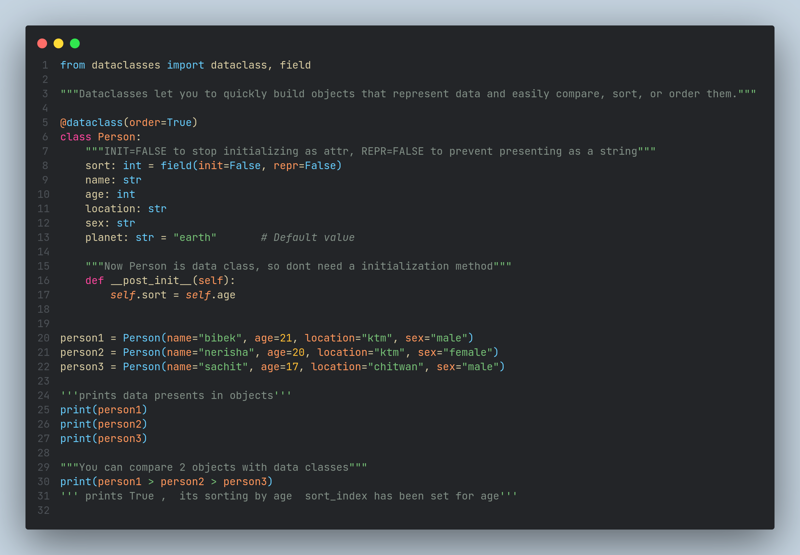
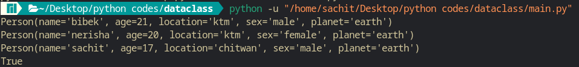

# Dataclasses in Python

### A dataclass can be used to decorate a user-defined class and to store data attributes.Dataclasses let you to quickly build objects that represent data and easily compare, sort, or order them.

## Code 

## output

