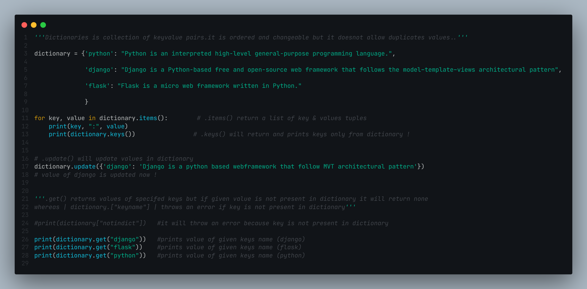

# Dictionary in Python

**A dictionary is a set of key-value pairs (key-value pairs). It is ordered and customizable, but duplicate values are not permitted.
The | dictionary.item() | function can be used to get all keys and values in a dictionary, and the keys() function can be used to acquire just the keys. Because we know that a dictionary may be edited and values added to it, we can use the | update() | method to update key value pairs in a dictionary.
I'm using dictionary.get("keyname") Why not using dictionary["keyname"] instead of .get("keyname") to obtain the value of its key? Because if the specified keyvalue is not present in the dictionary, dictionary[" "] would throw an error, while without terminating the program with errors, get() will return none.**

You will be appreciated for pointing out my blunder. 😉
## Screenshots

