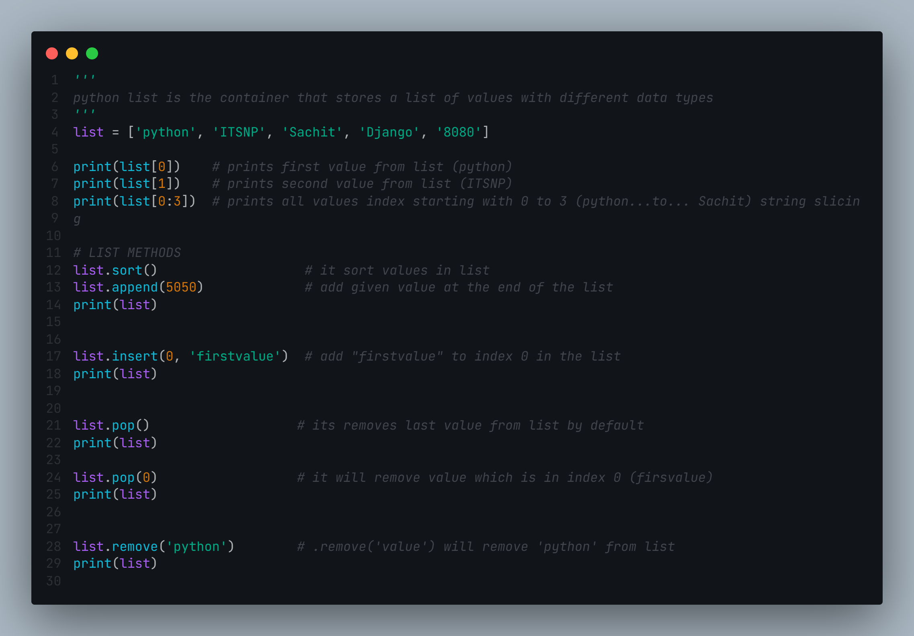
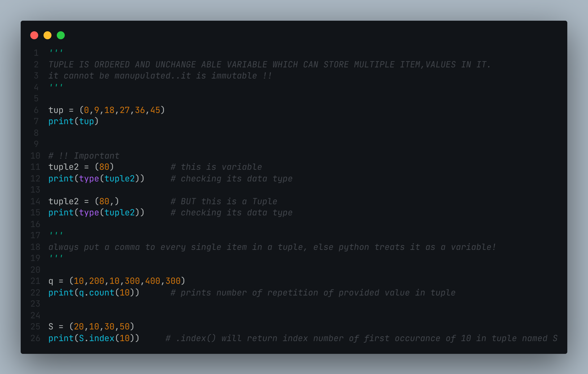

# List And Tuples in Python

**The list is one of Python's most popular data types. The square brackets [ ] easily identify a Python List. Lists are used to store data items, with a comma separating each data item (,). A Python List can contain data items of any data type, including integers and booleans.**
**Lists are mutable, which is one of the main reasons for their widespread use. Any data item in a List can be replaced by any other data item because it is mutable. This distinguishes Lists from Tuples, which are similarly used to store data items but are immutable.**

# Tuples
**It is a pre-ordered and immutable variable that can store many items and values.
Immutable! It can't be changed at all!!**

You will be appreciated for pointing out my blunder. 😉
## Screenshots
### List

### Tuples

  