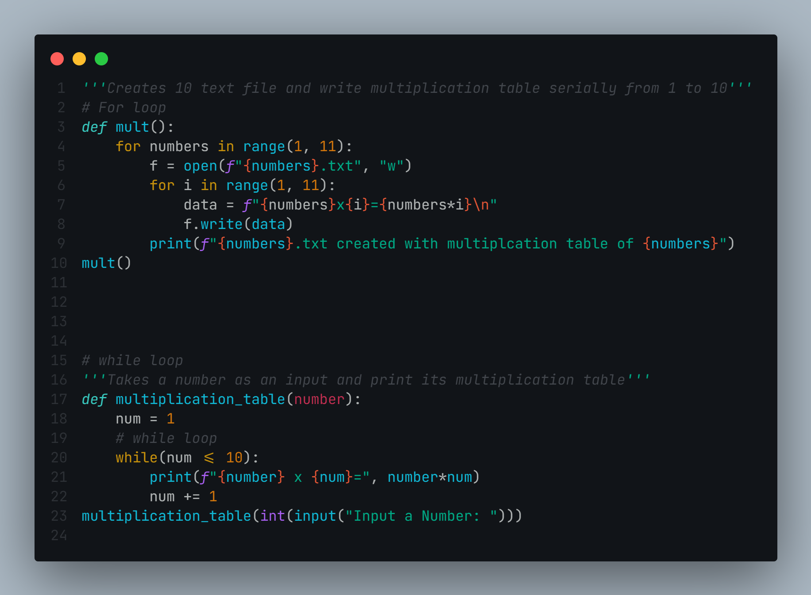

# Loops in Python

**Looping is the process of repeating something until a specific condition is met.
There are two sorts of loops in Python: while loops and for loops. While Loops are used to repeatedly run a block of instructions until a specific condition is met. When the condition is met, the line immediately following the loop in the program is performed.
And a for loop is a control flow statement that is used to execute a series of instructions repeatedly as long as the condition is met. An iterative statement is another name for this type of statement.**

You will be appreciated for pointing out my blunder. 😉
## Code

  