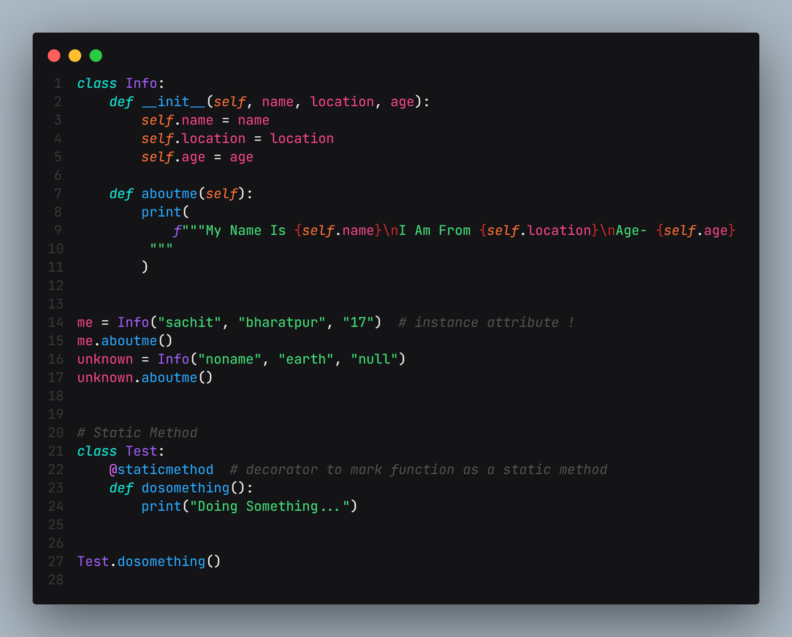
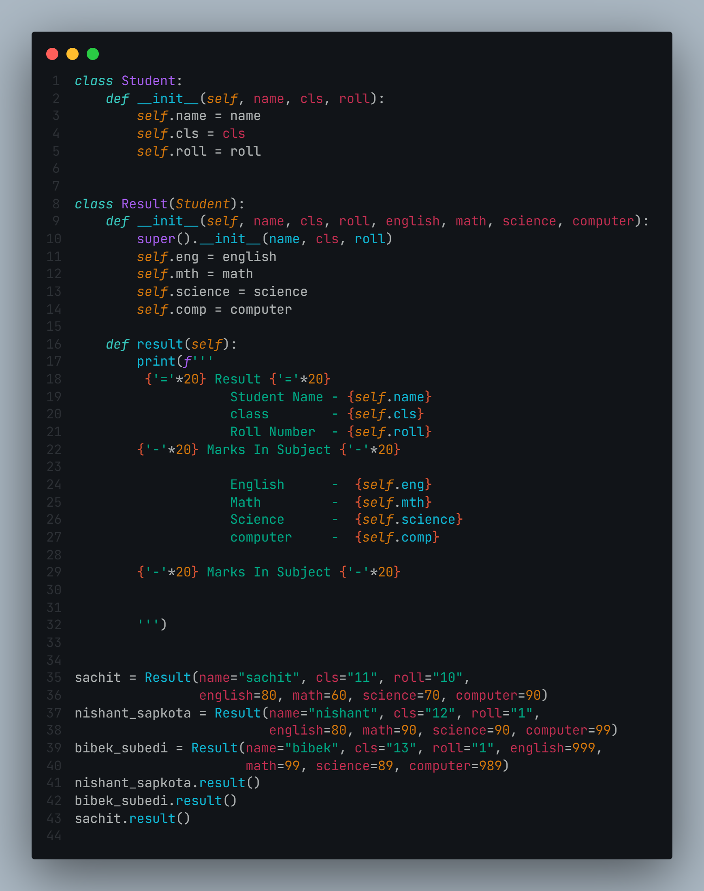

# Object Oriented Programming in Python

**Object-Oriented Programming is a method of computer programming that uses the concept of "objects" to represent data. It is also a method for producing reusable code rather than duplicate code. The program is broken down into self-contained objects or mini-programs.
Class is a kind of skeleton or a code template for generating an object. It logically arranges the data in such a way that code reuse is made simple. and Objects are instances of classes. It is a self-contained entity with state and behavior. It is a class instance that has access to the data.
class attribute - an attribute that belongs to a class rather than an object.
object attribute or instance attribute that belongs to a certain object
self parameter - self, The instance of a class that is automatically supplied with a function called from the object.
"__init__" constructor
In Python classes, the "__init__" constructor is a reserved function. When an object is generated from a class, this method is invoked, and it allows the class to initialize the attributes of the class.**

# Inheritance in OOP 
**Inheritance allows us to build a class that inherits all of the functionality of a parent class and adds new capabilities.
It refers to creating a new class with minimal or no changes to an existing class. The new class is known as the derived or child class, and the class from which it inherits is known as the parent class.
When a child class inherits from a single parent class, this is known as single inheritance, whereas multiple inheritance happens when a child class inherits from several parents classes.**

You will be appreciated for pointing out my blunder. 😀

### some more codes are present in repo check it out 😜

## Code
### OOP

## inheritance 

  